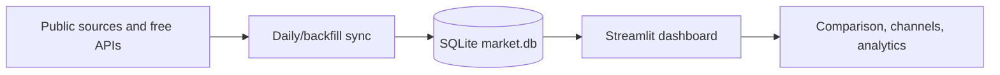

# Financial Dashboard

A local-first Streamlit market dashboard for Iranian and U.S. markets. It
stores observations in SQLite, refreshes politely once per day, and is designed
for long-horizon comparison rather than trading execution.

<!-- Screenshot placeholder: add a current dashboard screenshot here. -->

## Features

- Market Watch is the default page for a clean URL: grouped latest-value cards
  read stored data only and link to detailed charts. Monthly series are labeled
  monthly; policy rates and yields show basis-point changes. Existing chart
  URLs continue to open Charts directly.

- USD/Toman, gold, silver, Bitcoin, Ethereum, BNB, S&P 500, TEDPIX, U.S. CPI, and Iran CPI.
- Commodity includes gold, silver, and Brent crude oil spot prices (USD per barrel)
  from EIA via FRED (`DCOILBRENTEU`). Oil history is stored locally; daily sync
  requests recent dates with a seven-day overlap rather than the full history.
- Copper uses World Bank monthly averages in USD per metric ton from 1960.
  Daily sync checks for a missing completed month before downloading the workbook.
- Broad U.S. Dollar Index uses FRED `DTWEXBGS` (January 2006 = 100), not ICE DXY.
  Daily updates fetch recent dates with a seven-day overlap.
- Fed Funds Target joins FRED `DFEDTAR` from September 1982 through December 15,
  2008 with `DFEDTARU` (range upper limit) from December 16, 2008 onward.
  Pre-1994 target observations are reconstructed research data. Backfill imports
  both series; daily updates continue to use only the current target-range series.
- Logarithmic charts, regression corridors, a tighter 95% corridor, annualized
  trend and R², comparison overlays, and bounded zoom.
- U.S. Treasury 2-, 10-, and 30-year daily constant-maturity yields from FRED
  (`DGS2`, `DGS10`, `DGS30`), stored in percent and displayed as estimated
  cumulative interest growth rebased to 1× at the channel start. The prior
  observation's annual yield is compounded over elapsed days / 365.25.
  This illustrative index is not a bond total-return series.
  The initial import stores full history; daily sync fetches from the latest
  stored date with a seven-day overlap. Cumulative charts start after any long
  publication gap, so the 30-year growth view starts in February 2006 without
  inventing missing yields. Log scale and regression channels are available.
- Optional drawdown, rolling volatility, and inflation-adjusted views.
- Overview cards with 1D / 1M / 1Y movement and small sparklines.
- CSV download for the current visible series and cross-market monthly-return
  correlation.
- Derived Iran series: Gold in Toman and TEDPIX in USD terms, clearly labeled
  as calculated series.

## Data sources

| Source | Series | Cadence | Caveat |
| --- | --- | --- | --- |
| Bonbast graph | USD/Toman | Daily | Public chart parser; may change without notice. |
| DataBourse | TEDPIX | Daily | Third-party public chart, not the official exchange API. |
| World Bank Pink Sheet | Gold, silver | Monthly long history | Monthly averages/fixings. |
| Alpha Vantage | Gold, silver | Daily | Free key and rate limits required. |
| Yahoo Finance | Bitcoin, Ethereum, BNB | Daily | Free, no key; long daily history via `yfinance`. |
| Blockchain.com Charts API | Bitcoin before Yahoo coverage | Daily | Free market-price index; earliest values are sparse/indicative. |
| Gemini CSV archive | Ethereum before Yahoo coverage | Daily | Free, one-time historical extension. |
| Binance public API | BNB before Yahoo coverage | Daily | Free BNB/USDT candles; USDT is used as a USD proxy. |
| FRED | S&P 500, U.S. CPI | Daily / monthly | Requires a free key. |
| SCI public structured mirror | Iran CPI | Monthly | Publication lag and source revisions are possible. |
| Shiller-derived series / local SPX CSV | S&P 500 earlier history | Monthly / daily | Used only for the historical gap. |

## Architecture



## Setup

```bash
python3 -m venv .venv
.venv/bin/pip install -r requirements-dev.txt
cp .env.example .env
```

Add a free Alpha Vantage key to `.env`, then initialize the data. The initial
backfill imports World Bank Pink Sheet monthly gold and silver data from 1960,
then Alpha Vantage supplies the newer daily metal prices. Yahoo Finance supplies
the long daily history for Bitcoin, Ethereum, and BNB:

```bash
.venv/bin/python -m financial_dashboard.sync --backfill
.venv/bin/streamlit run app.py
```

## Streamlit Community Cloud

The repository includes a read-only SQLite data snapshot so the public app
starts with historical charts. On Community Cloud, use `app.py` as the
entrypoint, choose Python 3.12, and add `ALPHAVANTAGE_API_KEY` and
`FRED_API_KEY` through **App settings → Secrets**. Copy
`.streamlit/secrets.toml.example` into the Cloud secrets editor and add your
real values there; never commit them. Runtime refreshes are not durable after a
Cloud restart, so a production deployment should use an external database and
scheduled sync job.

For S&P 500 and U.S. CPI updates, add a free `FRED_API_KEY` too. The app still
runs when optional provider keys are not present; the relevant source is shown
as skipped in Data status.

Bonbast USD/Toman history does not need an API key. The initial import uses a free Bonbast-derived archive; daily values come directly from Bonbast's graph page. If a market provider key is missing, that source is skipped without preventing the other sources from updating.

## Daily updates

### Online app (GitHub Actions)

`.github/workflows/daily-prices.yml` updates the stored database daily at
**8:00 AM America/New_York**, adjusting automatically for daylight saving time
(12:00 UTC in summer, 13:00 UTC in winter). A timezone gate selects one of the
two UTC schedules; manual runs always proceed.
GitHub may start scheduled runs late; this is not a real-time price feed.

After pushing the workflow to `main`, add `FRED_API_KEY` and
`ALPHAVANTAGE_API_KEY` under **GitHub repository → Settings → Secrets and
variables → Actions → New repository secret**. Streamlit secrets are separate
and are not available to Actions. The workflow checks that both keys exist
before fetching data.

Run **Actions → Daily price update → Run workflow** for the first update.
The job commits only `data/market.db`; Streamlit Community Cloud picks up the
new repository snapshot. Successful sources are saved even if another source
fails, and the run is then marked failed so the problem is visible. Branch
protection must permit the Actions bot to push to `main`. Source publication
schedules still determine when new daily or monthly observations are available.

### Local app

Run an update manually:

```bash
.venv/bin/python -m financial_dashboard.sync --daily
```

Install the included macOS schedule (daily at 8:15 PM local time):

```bash
./scripts/install_scheduler.sh
```

Remove it with `./scripts/uninstall_scheduler.sh`. This local schedule does not
publish updates to the online app.

## Notes

- Bonbast values are stored and displayed in Toman.
- Gold and silver are USD per troy ounce. Their long-range monthly history is
  from the World Bank Pink Sheet (gold spot monthly average; silver London
  afternoon fixing); daily observations take over when Alpha Vantage data begins.
- TEDPIX is stored in index points from DataBourse's public chart page. The importer validates the embedded chart data before storing it; it is a third-party source, not the official exchange API.
- S&P 500 closes are sourced from FRED's official SP500 series. Add a free
  `FRED_API_KEY` to enable its most recent ten years of daily closing values.
  A one-time daily CSV import can fill the earlier history from 1960 through
  the day before FRED begins; the dashboard then uses FRED without overlap.
- A Shiller-derived, openly licensed monthly US-equities series remains the
  built-in fallback when a daily S&P 500 CSV has not been imported.
- U.S. Inflation uses FRED's monthly, not-seasonally-adjusted CPI-U series
  (`CPIAUCNS`) and is displayed as the conventional year-over-year percentage
  change. The raw CPI index is stored locally so a seasonally adjusted monthly
  momentum view can be added later.
- Iran Inflation uses the Statistical Center of Iran's monthly national CPI
  index via a public structured mirror. It is stored as an index level and
  displayed as cumulative inflation from the selected channel start.
- Price data is informational and may be delayed or revised by its source.
- The Bonbast collector makes low-frequency requests to the public graph page and stops on unexpected page changes.

## Development

```bash
.venv/bin/pytest -q
.venv/bin/ruff check .
```

GitHub Actions runs those checks on every push and pull request. See
[`docs/deployment.md`](docs/deployment.md) for a deployment design and the
risks of hosting public-page scrapers.
