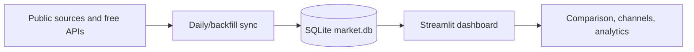

# Financial Dashboard

A local-first Streamlit market dashboard for Iranian and U.S. markets. It
stores observations in SQLite, refreshes politely once per day, and is designed
for long-horizon comparison rather than trading execution.

<!-- Screenshot placeholder: add a current dashboard screenshot here. -->

## Features

- USD/Toman, gold, silver, Bitcoin, S&P 500, TEDPIX, U.S. CPI, and Iran CPI.
- Logarithmic charts, regression corridors, a tighter 95% corridor, annualized
  trend and R², comparison overlays, and bounded zoom.
- Optional drawdown, rolling volatility, and inflation-adjusted views.
- Overview cards with 1D / 1M / 1Y movement and small sparklines.
- CSV download for the current visible series and cross-market monthly-return
  correlation.
- Derived Iran series: Gold in Toman and TEDPIX in USD terms, clearly labeled
  as calculated series.

## Data sources

| Source | Series | Cadence | Caveat |
| --- | --- | --- | --- |
| Bonbast graph | USD/Toman | Daily | Public chart parser; may change without notice. |
| DataBourse | TEDPIX | Daily | Third-party public chart, not the official exchange API. |
| World Bank Pink Sheet | Gold, silver | Monthly long history | Monthly averages/fixings. |
| Alpha Vantage | Gold, silver, Bitcoin | Daily | Free key and rate limits required. |
| FRED | S&P 500, U.S. CPI | Daily / monthly | Requires a free key. |
| SCI public structured mirror | Iran CPI | Monthly | Publication lag and source revisions are possible. |
| Shiller-derived series / local SPX CSV | S&P 500 earlier history | Monthly / daily | Used only for the historical gap. |

## Architecture



## Setup

```bash
python3 -m venv .venv
.venv/bin/pip install -r requirements-dev.txt
cp .env.example .env
```

Add a free Alpha Vantage key to `.env`, then initialize the data. The initial
backfill imports World Bank Pink Sheet monthly gold and silver data from 1960,
then Alpha Vantage supplies the newer daily gold, silver, and full Bitcoin
history. CoinGecko remains the one-year Bitcoin fallback when Alpha Vantage is
not configured:

```bash
.venv/bin/python -m financial_dashboard.sync --backfill
.venv/bin/streamlit run app.py
```

For S&P 500 and U.S. CPI updates, add a free `FRED_API_KEY` too. The app still
runs when optional provider keys are not present; the relevant source is shown
as skipped in Data status.

Bonbast USD/Toman history does not need an API key. The initial import uses a free Bonbast-derived archive; daily values come directly from Bonbast's graph page. If a market provider key is missing, that source is skipped without preventing the other sources from updating.

## Daily updates

Run an update manually:

```bash
.venv/bin/python -m financial_dashboard.sync --daily
```

Install the included macOS schedule (daily at 8:15 PM local time):

```bash
./scripts/install_scheduler.sh
```

Remove it with `./scripts/uninstall_scheduler.sh`. The dashboard also includes a **Refresh data** button.

## Notes

- Bonbast values are stored and displayed in Toman.
- Gold and silver are USD per troy ounce. Their long-range monthly history is
  from the World Bank Pink Sheet (gold spot monthly average; silver London
  afternoon fixing); daily observations take over when Alpha Vantage data begins.
- TEDPIX is stored in index points from DataBourse's public chart page. The importer validates the embedded chart data before storing it; it is a third-party source, not the official exchange API.
- S&P 500 closes are sourced from FRED's official SP500 series. Add a free
  `FRED_API_KEY` to enable its most recent ten years of daily closing values.
  A one-time daily CSV import can fill the earlier history from 1960 through
  the day before FRED begins; the dashboard then uses FRED without overlap.
- A Shiller-derived, openly licensed monthly US-equities series remains the
  built-in fallback when a daily S&P 500 CSV has not been imported.
- U.S. Inflation uses FRED's monthly, not-seasonally-adjusted CPI-U series
  (`CPIAUCNS`) and is displayed as the conventional year-over-year percentage
  change. The raw CPI index is stored locally so a seasonally adjusted monthly
  momentum view can be added later.
- Iran Inflation uses the Statistical Center of Iran's monthly national CPI
  index via a public structured mirror. It is stored as an index level and
  displayed as cumulative inflation from the selected channel start.
- Price data is informational and may be delayed or revised by its source.
- The Bonbast collector makes low-frequency requests to the public graph page and stops on unexpected page changes.

## Development

```bash
.venv/bin/pytest -q
.venv/bin/ruff check .
```

GitHub Actions runs those checks on every push and pull request. See
[`docs/deployment.md`](docs/deployment.md) for a deployment design and the
risks of hosting public-page scrapers.
